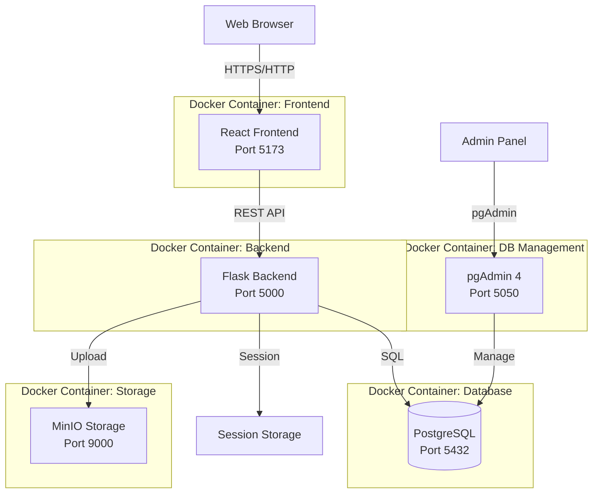
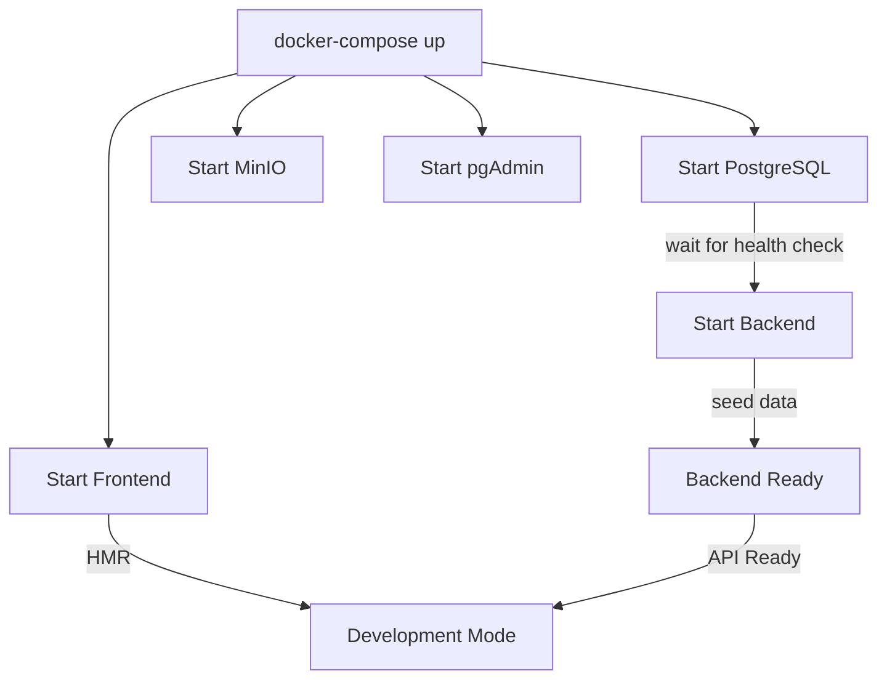

# 02 - Kiến Trúc Hệ Thống

## 🏗 Tổng Quan Kiến Trúc

Bookstore được xây dựng theo kiến trúc **Client-Server** với:
- **Frontend**: React SPA (Single Page Application)
- **Backend**: Flask REST API với 3-Layer Architecture
- **Database**: PostgreSQL
- **Containerization**: Docker & Docker Compose

## 📐 Sơ Đồ Kiến Trúc Tổng Thể



## 🎯 Mô Hình 3 Lớp (3-Layer Architecture)

Backend được thiết kế theo mô hình 3 lớp để **tách biệt trách nhiệm** và **dễ bảo trì**:

### 1️⃣ Presentation Layer (Lớp Trình Bày)

**📍 Vị trí:** `backend/routes/`

**🎯 Nhiệm vụ:**
- Xử lý HTTP Requests/Responses
- Parse và validate request data
- Gọi Business Logic Layer
- Format và trả về responses
- Handle errors và exceptions

**📁 Files:**
- `auth.py` - Authentication routes (login, register, profile)
- `books.py` - Book catalog routes (list, search, detail)
- `cart.py` - Shopping cart routes (add, update, remove)
- `orders.py` - Order management routes (create, list, status)
- `admin.py` - Admin panel routes (CRUD operations)
- `banners.py` - Banner management routes
- `chatbot.py` - Chatbot endpoint (future feature)
- `upload.py` - File upload handling

**✨ Đặc điểm:**
- **Thin layer**: Chỉ xử lý HTTP, không chứa business logic
- **Stateless**: Không lưu trữ state, chỉ pass data qua lại
- **Standard REST**: Follow RESTful principles

### 2️⃣ Business Logic Layer (Lớp Nghiệp Vụ)

**📍 Vị trí:** `backend/business/`

**🎯 Nhiệm vụ:**
- Implement business rules
- Validate business logic
- Coordinate workflows
- Transform data (DTOs)
- Enforce business constraints

**📦 Cấu trúc con:**

#### Services (`business/services/`)
Service interfaces - Orchestrate business operations

- `auth_service.py` - Authentication & authorization logic
- `book_service.py` - Book business operations
- `cart_service.py` - Cart business logic  
- `order_service.py` - Order processing logic
- `admin_service.py` - Admin operations

#### Components (`business/components/`)
Business validators - Validate business rules

- `book_validator.py` - Validate book data (price > 0, stock >= 0)
- `order_validator.py` - Validate orders (total amount, items)
- `cart_validator.py` - Validate cart operations

#### Workflows (`business/workflows/`)
Complex multi-step processes

- `order_workflow.py` - Handle complete order creation process:
  1. Validate cart
  2. Calculate total
  3. Create order
  4. Create order items
  5. Clear cart

#### DTOs (`business/dto/`)
Data Transfer Objects - Decouple layers

- `user_dto.py` - User data transfer object
- `book_dto.py` - Book data transfer object
- `cart_dto.py` - Cart item DTO
- `order_dto.py` - Order and OrderItem DTOs

**✨ Đặc điểm:**
- **Thick layer**: Chứa toàn bộ business logic
- **Reusable**: Services có thể được gọi từ nhiều routes
- **Testable**: Dễ dàng unit test business logic
- **Independent**: Không phụ thuộc vào Presentation Layer

### 3️⃣ Data Access Layer (Lớp Truy Cập Dữ Liệu)

**📍 Vị trí:** `backend/data/`

**🎯 Nhiệm vụ:**
- Encapsulate database operations
- CRUD operations
- Query execution
- Data persistence
- Transaction management

**📁 Files (DAOs - Data Access Objects):**
- `user_dao.py` - User database operations
- `book_dao.py` - Book database operations (search, pagination)
- `cart_dao.py` - Cart database operations
- `order_dao.py` - Order database operations

**✨ Đặc điểm:**
- **Encapsulation**: Hide SQL details from upper layers
- **Reusable**: Single source of truth for data operations
- **Maintainable**: Easy to change database implementation
- **Type-safe**: Return typed objects (Models or DTOs)

## 🔄 Luồng Dữ Liệu (Data Flow)

### Example: User Creates an Order

```
1. Frontend (React)
   └─> POST /api/orders 
       {shipping_address: "123 Street", phone: "0123456789"}

2. Presentation Layer (routes/orders.py)
   └─> Parse request body
   └─> Get user_id from session
   └─> Call OrderService.create_order()

3. Business Logic Layer (services/order_service.py)
   └─> Call CartService.get_cart(user_id)
   └─> Validate cart not empty (OrderValidator)
   └─> Call OrderWorkflow.create_order_with_items()

4. Business Workflow (workflows/order_workflow.py)
   └─> Begin transaction
   └─> Calculate total amount
   └─> Create Order via OrderDAO
   └─> Create OrderItems via OrderDAO
   └─> Clear cart via CartDAO
   └─> Commit transaction
   └─> Return OrderDTO

5. Business Logic Layer
   └─> Transform Order model to OrderDTO
   └─> Return to Presentation Layer

6. Presentation Layer
   └─> Format OrderDTO to JSON
   └─> Return HTTP 201 Created

7. Frontend
   └─> Receive response
   └─> Update UI, redirect to orders page
```

## 📂 Cấu Trúc Thư Mục Chi Tiết

```
bookstore/
├── backend/                    # Flask Backend
│   ├── app.py                 # Main Flask application
│   ├── config.py              # Configuration
│   ├── models.py              # SQLAlchemy models (User, Book, Cart, Order, etc.)
│   ├── seed_data.py           # Database seeding
│   │
│   ├── routes/                # 🔷 PRESENTATION LAYER
│   │   ├── __init__.py
│   │   ├── auth.py           # /api/auth/* endpoints
│   │   ├── books.py          # /api/books/* endpoints
│   │   ├── cart.py           # /api/cart/* endpoints
│   │   ├── orders.py         # /api/orders/* endpoints
│   │   ├── admin.py          # /api/admin/* endpoints
│   │   ├── banners.py        # /api/banners/* endpoints
│   │   ├── chatbot.py        # /api/chatbot/* endpoints
│   │   └── upload.py         # /api/upload/* endpoints
│   │
│   ├── business/              # 🔷 BUSINESS LOGIC LAYER
│   │   ├── __init__.py
│   │   │
│   │   ├── dto/              # Data Transfer Objects
│   │   │   ├── __init__.py
│   │   │   ├── user_dto.py
│   │   │   ├── book_dto.py
│   │   │   ├── cart_dto.py
│   │   │   └── order_dto.py
│   │   │
│   │   ├── services/         # Service Layer
│   │   │   ├── __init__.py
│   │   │   ├── auth_service.py
│   │   │   ├── book_service.py
│   │   │   ├── cart_service.py
│   │   │   ├── order_service.py
│   │   │   └── admin_service.py
│   │   │
│   │   ├── components/       # Business Validators
│   │   │   ├── __init__.py
│   │   │   ├── book_validator.py
│   │   │   ├── order_validator.py
│   │   │   └── cart_validator.py
│   │   │
│   │   └── workflows/        # Complex Workflows
│   │       ├── __init__.py
│   │       └── order_workflow.py
│   │
│   ├── data/                  # 🔷 DATA ACCESS LAYER
│   │   ├── __init__.py
│   │   ├── user_dao.py       # User DAO
│   │   ├── book_dao.py       # Book DAO  
│   │   ├── cart_dao.py       # Cart DAO
│   │   └── order_dao.py      # Order DAO
│   │
│   ├── utils/                 # Utilities
│   │   ├── __init__.py
│   │   ├── helpers.py        # Helper functions (hash_password, etc.)
│   │   └── storage.py        # MinIO storage utils
│   │
│   ├── requirements.txt       # Python dependencies
│   └── Dockerfile            # Docker config for backend
│
├── frontend/                  # React Frontend
│   ├── src/
│   │   ├── App.tsx           # Main App component
│   │   ├── main.tsx          # Entry point
│   │   │
│   │   ├── components/       # React components
│   │   │   ├── ui/          # UI components
│   │   │   ├── layout/      # Layout components
│   │   │   ├── shared/      # Shared components
│   │   │   └── auth/        # Auth components
│   │   │
│   │   ├── pages/           # Page components
│   │   │   ├── public/      # Public pages
│   │   │   ├── auth/        # Auth pages
│   │   │   └── admin/       # Admin pages
│   │   │
│   │   ├── contexts/        # React Context (State)
│   │   │   ├── AuthContext.tsx
│   │   │   └── CartContext.tsx
│   │   │
│   │   ├── services/        # API services
│   │   │   └── api.ts
│   │   │
│   │   └── types/           # TypeScript types
│   │       └── index.ts
│   │
│   ├── package.json
│   ├── vite.config.ts
│   ├── tailwind.config.js
│   └── Dockerfile.dev        # Docker config for frontend
│
├── database/
│   └── init.sql              # Reference only (SQLAlchemy creates tables)
│
├── docs/                      # Documentation
│   ├── 00-README.md
│   ├── 01-INTRODUCTION.md
│   ├── 02-SYSTEM_ARCHITECTURE.md (you are here)
│   ├── ...
│   └── diagrams/
│
├── docker-compose.yml         # Docker Compose config
└── README.md                 # Project README
```

## 🐳 Docker Architecture

### Containers

| Container | Service | Port | Volume | Purpose |
|-----------|---------|------|--------|---------|
| `bookstore_frontend` | React/Vite | 5173 | `./frontend:/app` | Frontend SPA với HMR |
| `bookstore_backend` | Flask | 5000 | `./backend:/app` | REST API Backend |
| `bookstore_db` | PostgreSQL 15 | 5432 | `postgres_data` | Main database |
| `bookstore_minio` | MinIO | 9000, 9001 | `minio_data` | Object storage |
| `bookstore_pgadmin` | pgAdmin 4 | 5050 | `pgadmin_data` | DB management tool |

### Networks

Tất cả containers được kết nối qua một Docker network: `bookstore_network`

### Volumes

- `postgres_data`: Persistent storage cho PostgreSQL
- `minio_data`: Persistent storage cho MinIO
- `pgadmin_data`: Persistent storage cho pgAdmin config

### Docker Compose Flow



## 🔐 Security Architecture

### Authentication Flow

```
User Login
    ↓
Frontend POST /api/auth/login {username, password}
    ↓
Backend: check_password(hashed_password, input_password)
    ↓
If valid: Create session, set session['user_id']
    ↓
Return user info (without password hash)
    ↓
Frontend: Store user in AuthContext
    ↓
Subsequent requests: Send session cookie automatically
    ↓
Backend: Check session['user_id'] with @login_required decorator
```

### Session Management

- **Storage**: Server-side session (Flask-Session)
- **Cookie**: `session` cookie với `httponly=True`
- **Expiry**: Session expires on browser close or after timeout
- **Security**: Password hashed với bcrypt

### Authorization

- **Role-based**: `admin`, `staff`, `customer`
- **Decorator**: `@admin_required` for admin-only routes
- **Frontend**: `ProtectedRoute` component cho admin pages

## 🚀 Deployment Architecture

### Development

```
Developer Machine
└── Docker Compose
    ├── Frontend (dev mode, HMR)
    ├── Backend (auto-reload)
    ├── PostgreSQL
    ├── MinIO
    └── pgAdmin
```

### Production (Future)

```
Production Server
├── Nginx (Reverse Proxy)
│   ├── Frontend (static files)
│   └── Backend (API proxy)
├── Gunicorn (WSGI Server)
│   └── Flask App (multiple workers)
├── PostgreSQL (external or RDS)
└── Cloud Storage (AWS S3, not MinIO)
```

## ⚡ Performance Considerations

### Backend Optimizations

- **SQLAlchemy ORM**: Lazy loading, eager loading when needed
- **Pagination**: All list endpoints support pagination
- **Indexing**: Database indexes trên `username`, `email`, `created_at`
- **Caching**: Session-based caching (planned: Redis)

### Frontend Optimizations

- **Code Splitting**: Route-based code splitting
- **Lazy Loading**: Dynamic imports cho pages
- **Vite**: Fast HMR và optimized production build
- **Tailwind CSS**: PurgeCSS removes unused styles

## 📊 Scalability

### Horizontal Scaling Possibilities

- **Backend**: Multiple Flask instances behind load balancer
- **Database**: Read replicas for read-heavy operations
- **Storage**: Distributed object storage (S3, MinIO cluster)
- **Cache**: Redis for session storage và caching

### Current Limitations

- Session storage in-memory (single instance only)
- No load balancing
- No CDN for static assets
- Single database instance

---

**📌 Key Takeaways:**
1. **3-Layer Architecture** tách biệt rõ ràng responsibilities
2. **DTOs** decouple layers và provide type safety
3. **Docker** ensures consistent development/deployment
4. **REST API** follow standard conventions
5. **Security** with password hashing và session management

