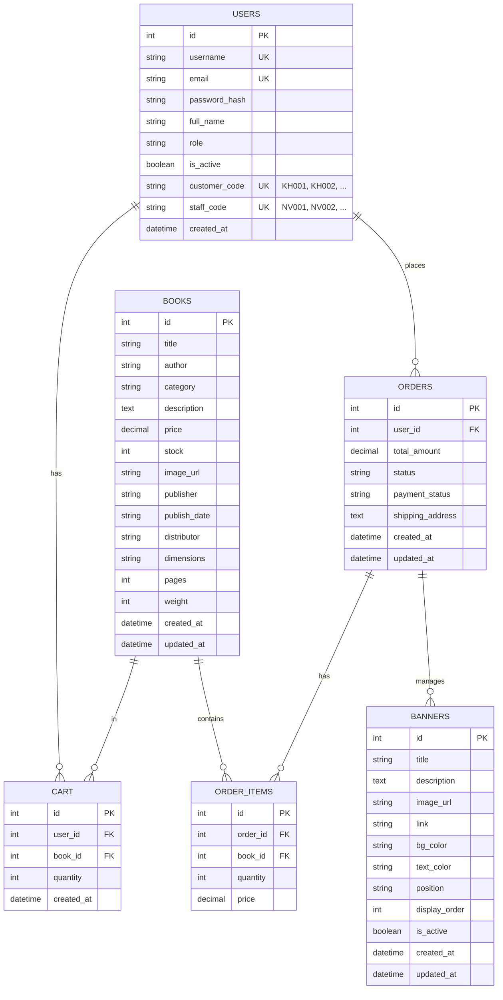

# Database Schema Documentation

## Overview

Database: PostgreSQL
ORM: SQLAlchemy (Flask-SQLAlchemy)

## Entity Relationship Diagram



## Tables

### 1. Users Table

**Table Name:** `users`

| Column | Type | Constraints | Description |
|--------|------|-------------|-------------|
| id | INTEGER | PRIMARY KEY | User ID (auto-increment) |
| username | VARCHAR(80) | UNIQUE, NOT NULL | Login username |
| email | VARCHAR(120) | UNIQUE, NOT NULL | Email address |
| password_hash | VARCHAR(255) | NOT NULL | Hashed password |
| full_name | VARCHAR(100) | NULL | Full name |
| role | VARCHAR(20) | NOT NULL, DEFAULT 'customer' | user role: admin/staff/customer |
| is_active | BOOLEAN | NOT NULL, DEFAULT TRUE | Account status |
| **customer_code** | VARCHAR(20) | UNIQUE, NULL | Customer code (KH001, KH002, ...) |
| **staff_code** | VARCHAR(20) | UNIQUE, NULL | Staff code (NV001, NV002, ...) |
| created_at | DATETIME | DEFAULT CURRENT_TIMESTAMP | Creation time |

#### User Code Generation

**Customer Code Format:** `KH` + zero-padded 3-digit number
- Examples: `KH001`, `KH002`, `KH003`, ..., `KH999`
- Auto-generated when creating a new customer
- Sequence is independent from staff codes

**Staff Code Format:** `NV` + zero-padded 3-digit number
- Examples: `NV001`, `NV002`, `NV003`, ..., `NV999`
- Auto-generated when creating a new staff member
- Sequence is independent from customer codes

**Generation Algorithm:**
```python
def generate_customer_code():
    # Find highest customer code
    last_customer = User.query.filter(
        User.role == 'customer',
        User.customer_code.isnot(None)
    ).order_by(User.customer_code.desc()).first()
    
    if last_customer and last_customer.customer_code:
        num = int(last_customer.customer_code[2:]) + 1
    else:
        num = 1
    
    return f"KH{num:03d}"  # KH001, KH002, etc.
```

**Why Separate Codes?**
- Clear identification: Customer vs Staff
- Independent sequences: Each type counts from 001
- Business logic: Easier reporting and analytics
- Display: Admin panel shows appropriate code in "Mã KH" or "Mã NV" column

### 2. Books Table

**Table Name:** `books`

| Column | Type | Constraints | Description |
|--------|------|-------------|-------------|
| id | INTEGER | PRIMARY KEY | Book ID |
| title | VARCHAR(200) | NOT NULL | Book title |
| author | VARCHAR(100) | NOT NULL | Author name |
| category | VARCHAR(50) | NOT NULL | Book category |
| description | TEXT | NULL | Book description |
| price | DECIMAL(10,2) | NOT NULL | Book price (VND) |
| stock | INTEGER | NOT NULL, DEFAULT 0 | Stock quantity |
| image_url | VARCHAR(500) | NULL | Cover image URL |
| publisher | VARCHAR(200) | NULL | Publisher name |
| publish_date | VARCHAR(20) | NULL | Publish date |
| distributor | VARCHAR(200) | NULL | Distributor |
| dimensions | VARCHAR(100) | NULL | Size (cm) |
| pages | INTEGER | NULL | Number of pages |
| weight | INTEGER | NULL | Weight (grams) |
| created_at | DATETIME | DEFAULT CURRENT_TIMESTAMP | Created time |
| updated_at | DATETIME | DEFAULT CURRENT_TIMESTAMP | Updated time |

### 3. Cart Table

**Table Name:** `cart`

| Column | Type | Constraints | Description |
|--------|------|-------------|-------------|
| id | INTEGER | PRIMARY KEY | Cart item ID |
| user_id | INTEGER | FOREIGN KEY (users.id), NOT NULL | User ID |
| book_id | INTEGER | FOREIGN KEY (books.id), NOT NULL | Book ID |
| quantity | INTEGER | NOT NULL, DEFAULT 1 | Quantity |
| created_at | DATETIME | DEFAULT CURRENT_TIMESTAMP | Added time |

### 4. Orders Table

**Table Name:** `orders`

| Column | Type | Constraints | Description |
|--------|------|-------------|-------------|
| id | INTEGER | PRIMARY KEY | Order ID |
| user_id | INTEGER | FOREIGN KEY (users.id), NOT NULL | User ID |
| total_amount | DECIMAL(10,2) | NOT NULL | Total order amount |
| status | VARCHAR(20) | NOT NULL, DEFAULT 'pending' | Order status |
| payment_status | VARCHAR(20) | NOT NULL, DEFAULT 'pending' | Payment status |
| shipping_address | TEXT | NOT NULL | Delivery address |
| created_at | DATETIME | DEFAULT CURRENT_TIMESTAMP | Order time |
| updated_at | DATETIME | DEFAULT CURRENT_TIMESTAMP | Last update |

**Status Values:**
- `pending` - Chờ xác nhận
- `confirmed` - Đã xác nhận
- `cancelled` - Đã hủy
- `completed` - Hoàn thành

**Payment Status:**
- `pending` - Chưa thanh toán
- `paid` - Đã thanh toán

### 5. Order Items Table

**Table Name:** `order_items`

| Column | Type | Constraints | Description |
|--------|------|-------------|-------------|
| id | INTEGER | PRIMARY KEY | Order item ID |
| order_id | INTEGER | FOREIGN KEY (orders.id), NOT NULL | Order ID |
| book_id | INTEGER | FOREIGN KEY (books.id), NOT NULL | Book ID |
| quantity | INTEGER | NOT NULL | Quantity ordered |
| price | DECIMAL(10,2) | NOT NULL | Price at order time |

### 6. Banners Table

**Table Name:** `banners`

| Column | Type | Constraints | Description |
|--------|------|-------------|-------------|
| id | INTEGER | PRIMARY KEY | Banner ID |
| title | VARCHAR(200) | NOT NULL | Banner title |
| description | TEXT | NULL | Banner description |
| image_url | VARCHAR(500) | NOT NULL | Banner image URL |
| link | VARCHAR(500) | NULL | Click destination URL |
| bg_color | VARCHAR(50) | DEFAULT '#6366f1' | Background color |
| text_color | VARCHAR(50) | DEFAULT '#ffffff' | Text color |
| position | VARCHAR(20) | DEFAULT 'main' | Position: main/side_top/side_bottom |
| display_order | INTEGER | DEFAULT 0 | Display order |
| is_active | BOOLEAN | DEFAULT TRUE | Active status |
| created_at | DATETIME | DEFAULT CURRENT_TIMESTAMP | Created time |
| updated_at | DATETIME | DEFAULT CURRENT_TIMESTAMP | Updated time |

## Relationships

- **Users → Cart**: One-to-Many (One user can have many cart items)
- **Users → Orders**: One-to-Many (One user can place many orders)
- **Books → Cart**: One-to-Many (One book can be in many carts)
- **Books → Order Items**: One-to-Many (One book can be in many orders)
- **Orders → Order Items**: One-to-Many (One order contains many items)

## Indexes

- `users.username` - UNIQUE index for fast login lookup
- `users.email` - UNIQUE index for uniqueness check
- `users.customer_code` - UNIQUE index for customer lookup
- `users.staff_code` - UNIQUE index for staff lookup
- `cart.user_id` - Index for cart queries
- `orders.user_id` - Index for order history queries

## Migration Notes

### Adding Customer/Staff Codes

When migrating existing database:

1. Add columns:
```sql
ALTER TABLE users ADD COLUMN customer_code VARCHAR(20) UNIQUE;
ALTER TABLE users ADD COLUMN staff_code VARCHAR(20) UNIQUE;
```

2. Generate codes for existing users:
```python
# For customers
customers = User.query.filter_by(role='customer').all()
for i, customer in enumerate(customers, 1):
    customer.customer_code = f"KH{i:03d}"

# For staff
staff = User.query.filter_by(role='staff').all()
for i, member in enumerate(staff, 1):
    member.staff_code = f"NV{i:03d}"

db.session.commit()
```

---

*Last updated: November 2024*

