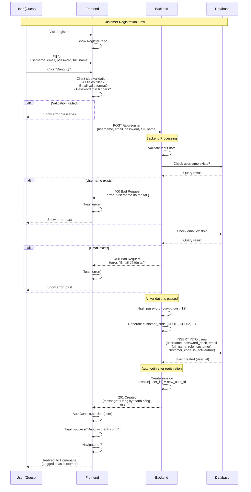
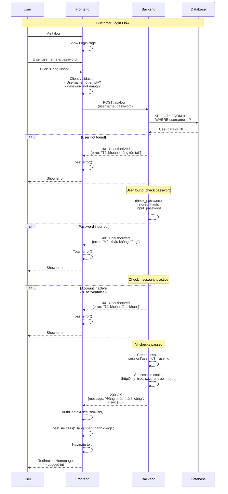
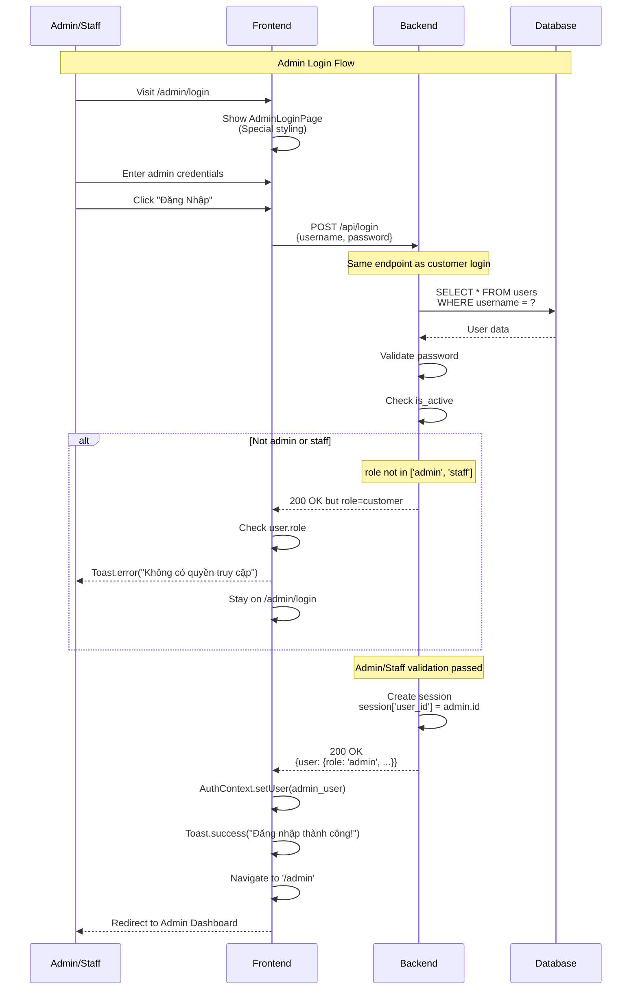
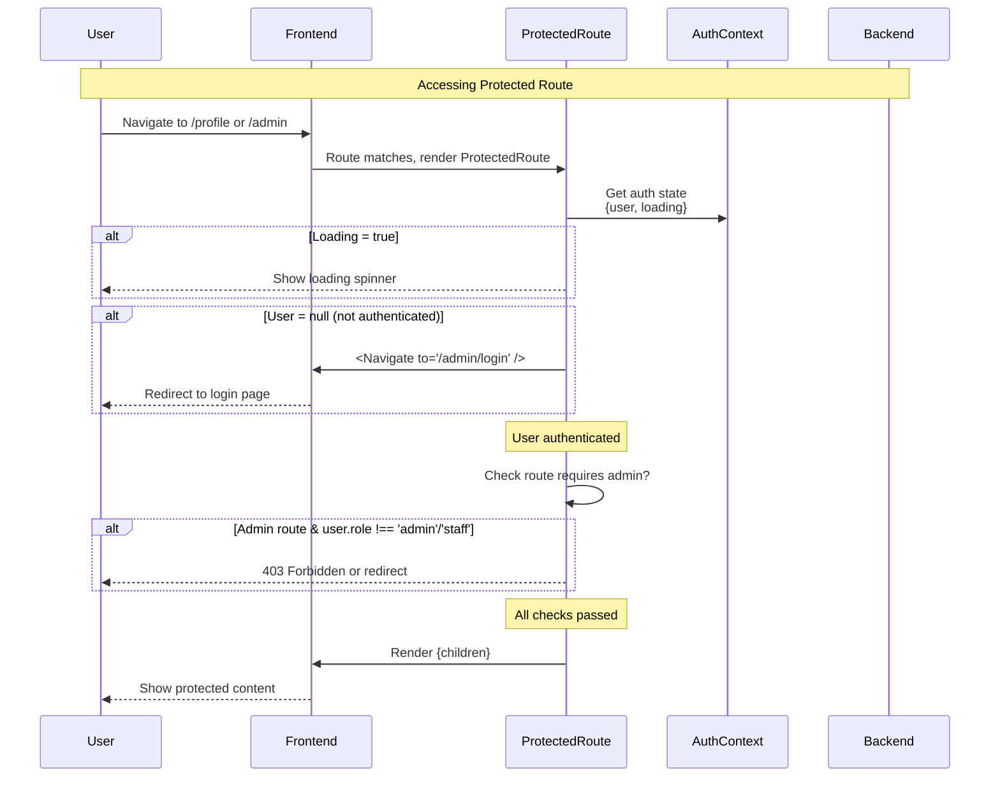
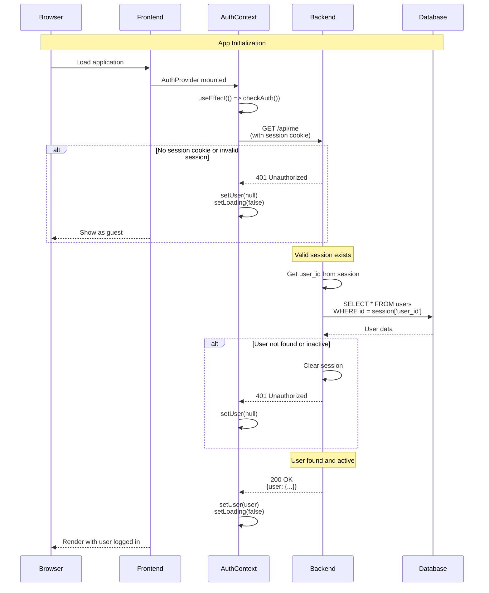
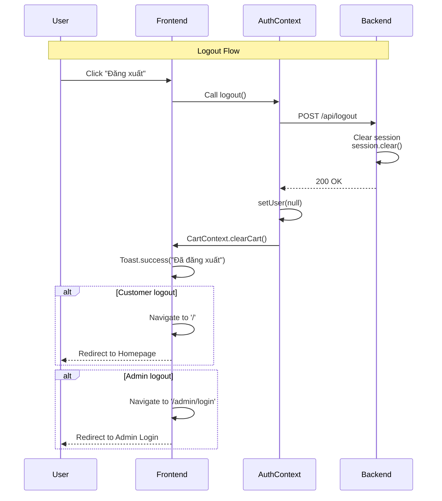

# 07 - Luồng Xác Thực (Authentication Flow)

## 🔐 Tổng Quan

Hệ thống sử dụng **Session-based Authentication** với:
- **Backend**: Flask-Session với server-side session storage
- **Frontend**: React Context để quản lý auth state
- **Security**: bcrypt password hashing, httpOnly cookies

## 🎯 Authentication Methods

| Method | Endpoint | Cho ai | Redirect |
|--------|----------|--------|----------|
| **Customer Register** | `/api/register` | Guest | Homepage (auto login) |
| **Customer Login** | `/api/login` | Guest | Homepage |
| **Admin Login** | `/api/login` | Admin/Staff | `/admin` dashboard |
| **Logout** | `/api/logout` | All | Tùy role |

## 📋 Flow Diagrams

### 1. Customer Registration Flow



### 2. Customer Login Flow



### 3. Admin Login Flow



### 4. Protected Route Flow



### 5. Session Check on App Load



### 6. Logout Flow



## 🔒 Security Features

### 1. Password Security

```python
# Backend: utils/helpers.py
import bcrypt

def hash_password(password: str) -> str:
    """Hash password với bcrypt cost factor 12"""
    return bcrypt.hashpw(
        password.encode('utf-8'), 
        bcrypt.gensalt(rounds=12)
    ).decode('utf-8')

def check_password(hashed: str, plain: str) -> bool:
    """Verify password"""
    return bcrypt.checkpw(
        plain.encode('utf-8'),
        hashed.encode('utf-8')
    )
```

**Security Properties:**
- **Slow hashing**: Cost factor 12 = 2^12 iterations (secure but reasonable)
- **Unique salt**: Mỗi password có salt riêng (tự động)
- **No plain text**: Không bao giờ lưu plain password
- **Rainbow table resistant**: Salt prevents rainbow table attacks

### 2. Session Security

```python
# Backend: app.py
app.config['SESSION_COOKIE_HTTPONLY'] = True  # Không thể access từ JS
app.config['SESSION_COOKIE_SAMESITE'] = 'Lax'  # CSRF protection
app.config['SESSION_COOKIE_SECURE'] = True  # HTTPS only (production)
app.config['PERMANENT_SESSION_LIFETIME'] = timedelta(days=7)
```

**Security Properties:**
- **httpOnly**: Prevents XSS attacks (JS cannot read cookie)
- **SameSite**: Prevents CSRF attacks
- **Secure**: HTTPS only in production
- **Expiration**: 7-day timeout

### 3. Input Validation

```python
# Backend: business/services/auth_service.py
def register(username, email, password, full_name):
    # Validation rules
    if not username or len(username) < 4:
        return None, "Username phải có ít nhất 4 ký tự"
    
    if not re.match(r'^[a-zA-Z0-9._%+-]+@[a-zA-Z0-9.-]+\.[a-zA-Z]{2,}$', email):
        return None, "Email không hợp lệ"
    
    if len(password) < 6:
        return None, "Mật khẩu phải có ít nhất 6 ký tự"
    
    if not full_name:
        return None, "Họ tên không được để trống"
    
    # Check uniqueness
    if UserDAO.get_by_username(username):
        return None, "Username đã tồn tại"
    
    if UserDAO.get_by_email(email):
        return None, "Email đã tồn tại"
    
    # Proceed with registration...
```

### 4. Rate Limiting (Future Enhancement)

```python
# Recommended: Add Flask-Limiter
from flask_limiter import Limiter

limiter = Limiter(app, key_func=get_remote_address)

@auth_bp.route('/login', methods=['POST'])
@limiter.limit("5 per minute")  # Max 5 login attempts per minute
def login():
    # ...
```

## 🎯 Frontend Implementation

### AuthContext.tsx

```typescript
export const AuthProvider: React.FC<{ children: ReactNode }> = ({ children }) => {
  const [user, setUser] = useState<User | null>(null)
  const [loading, setLoading] = useState(true)

  // Check auth on mount
  useEffect(() => {
    checkAuth()
  }, [])

  const checkAuth = async () => {
    try {
      const currentUser = await authService.getCurrentUser()
      setUser(currentUser)
    } catch (error) {
      setUser(null)
    } finally {
      setLoading(false)
    }
  }

  const login = async (username: string, password: string) => {
    const user = await authService.login({ username, password })
    setUser(user)
  }

  const register = async (data: RegisterRequest) => {
    const user = await authService.register(data)
    setUser(user)
  }

  const logout = async () => {
    await authService.logout()
    setUser(null)
  }

  return (
    <AuthContext.Provider value={{ user, loading, setUser, login, register, logout, checkAuth }}>
      {children}
    </AuthContext.Provider>
  )
}
```

### ProtectedRoute.tsx

```typescript
export const ProtectedRoute: React.FC<ProtectedRouteProps> = ({ children }) => {
  const { user, loading } = useAuth()

  if (loading) {
    return (
      <div className="min-h-screen flex items-center justify-center">
        <div className="animate-spin rounded-full h-12 w-12 border-b-2 border-primary"></div>
      </div>
    )
  }

  if (!user) {
    return <Navigate to="/admin/login" replace />
  }

  return <>{children}</>
}
```

## 📊 Authentication States

| State | user | loading | Action |
|-------|------|---------|--------|
| **Initial** | null | true | Check auth |
| **Guest** | null | false | Show login/register |
| **Customer** | {..., role:'customer'} | false | Full access |
| **Admin** | {..., role:'admin'} | false | Admin access |
| **Checking** | null/user | true | Show spinner |

## 🔍 Troubleshooting

### Issue: "Yêu cầu đăng nhập" after login

**Cause**: Session cookie không được gửi

**Solution:**
```typescript
// Frontend: api.ts
const api = axios.create({
  baseURL: API_BASE_URL,
  withCredentials: true,  // ← Must be true!
})
```

```python
# Backend: app.py
CORS(app, 
     supports_credentials=True,  # ← Must be true!
     origins=['http://localhost:5173'])
```

### Issue: Admin cannot login

**Check:**
1. User role = 'admin' or 'staff' in database?
2. is_active = true?
3. Correct redirect logic after login?

### Issue: Session expires too fast

**Adjust:**
```python
# Backend: app.py
app.config['PERMANENT_SESSION_LIFETIME'] = timedelta(days=30)  # Longer session
```

---

## 📋 Summary

### Authentication Flow Summary

✅ **Registration**: Validate → Hash password → Generate code → Save → Auto-login  
✅ **Login**: Validate credentials → Check active → Create session → Return user  
✅ **Protected Routes**: Check session → Verify role → Render or redirect  
✅ **Logout**: Clear session → Clear frontend state → Redirect  

### Security Checklist

✅ Passwords hashed với bcrypt (cost=12)  
✅ Session cookies với httpOnly  
✅ Input validation (frontend + backend)  
✅ Unique username & email constraints  
✅ Account active check  
✅ Role-based access control  
⚠️ Rate limiting (recommended addition)  
⚠️ Two-factor authentication (future)  

---

**📌 Authentication system đơn giản nhưng secure, phù hợp cho đồ án tốt nghiệp!**

