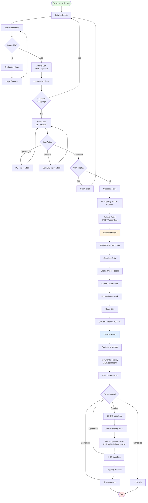
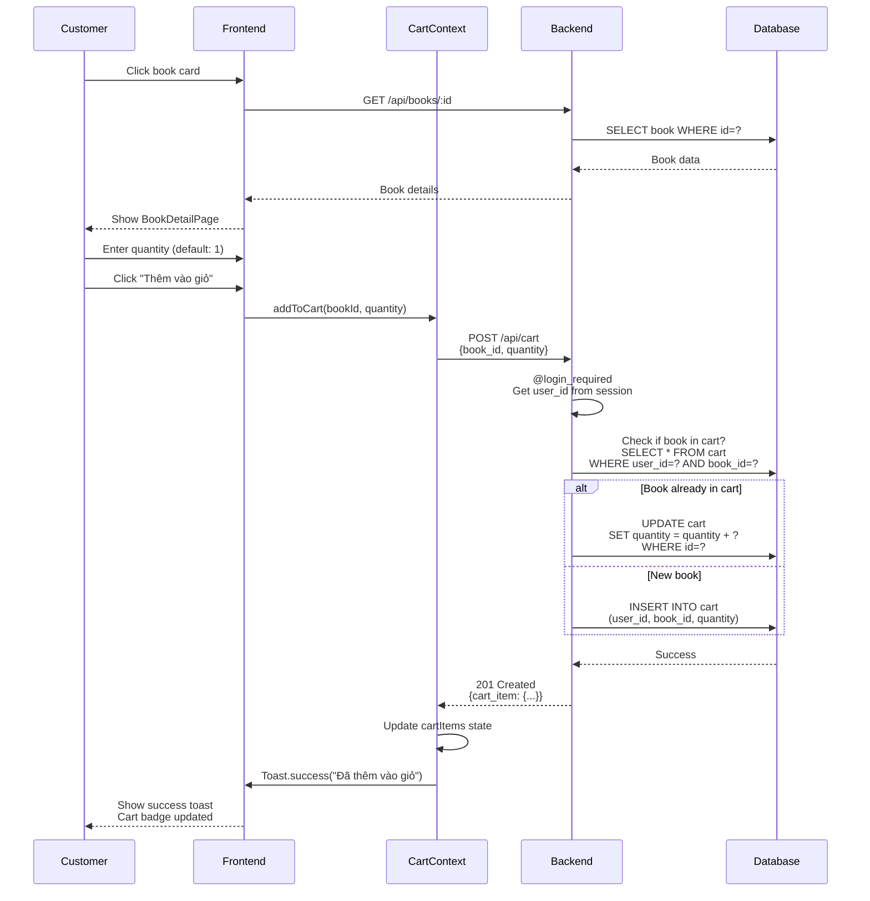
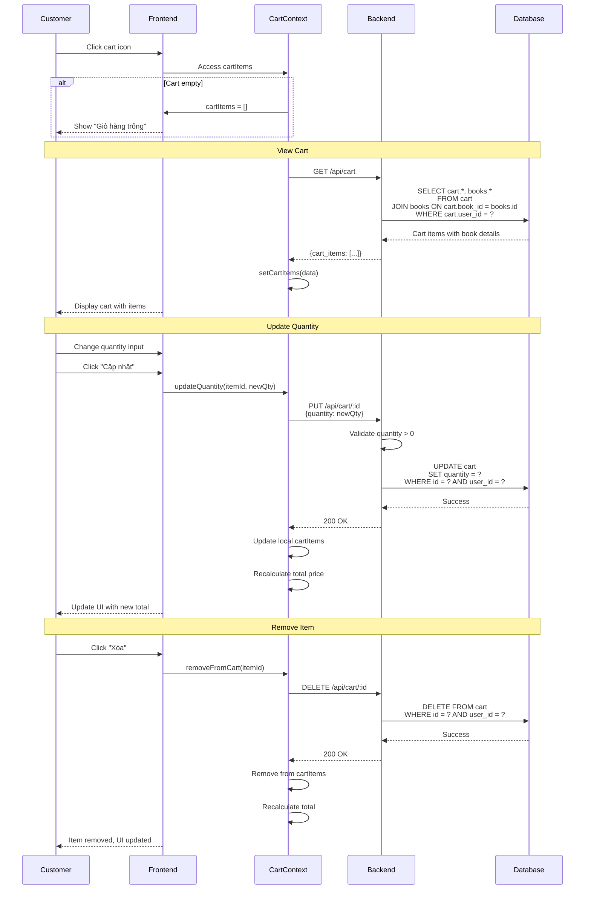
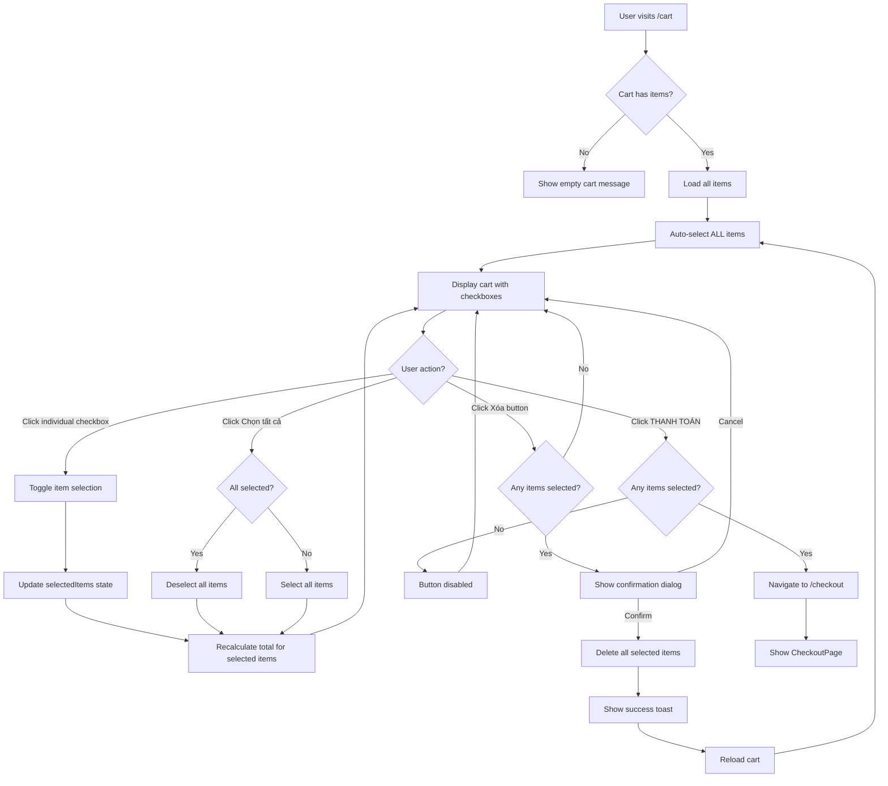
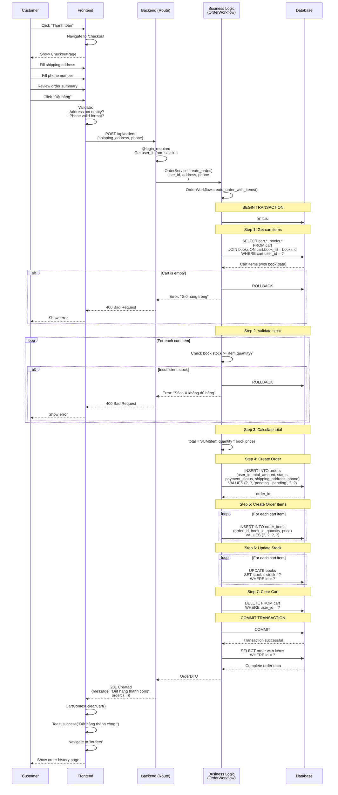
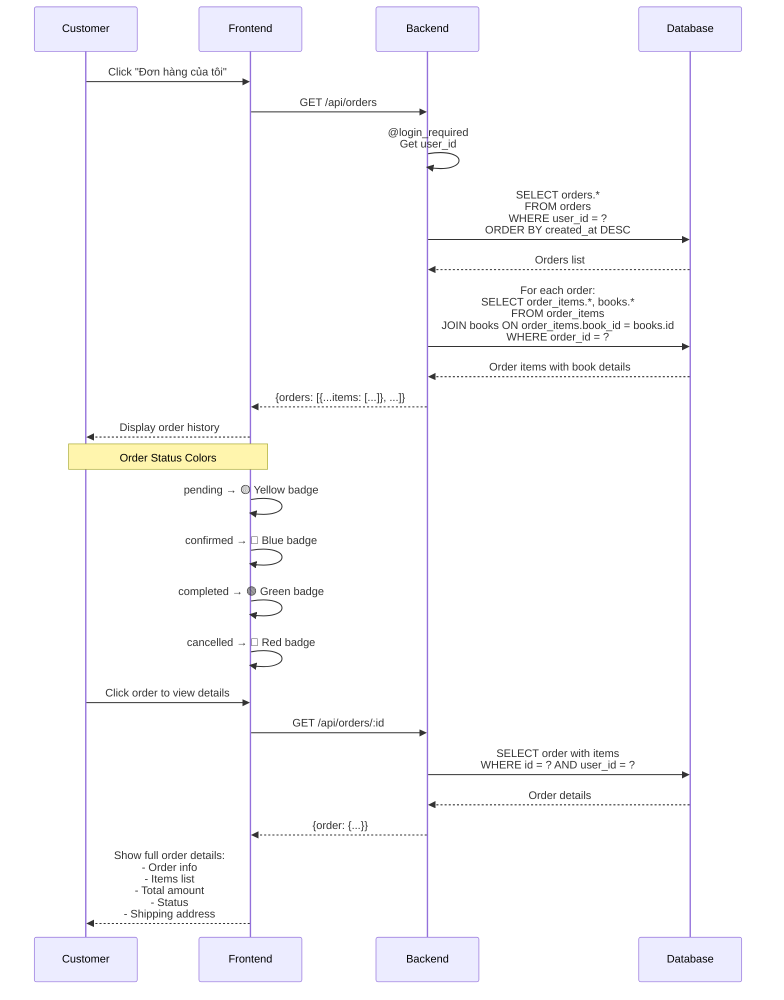
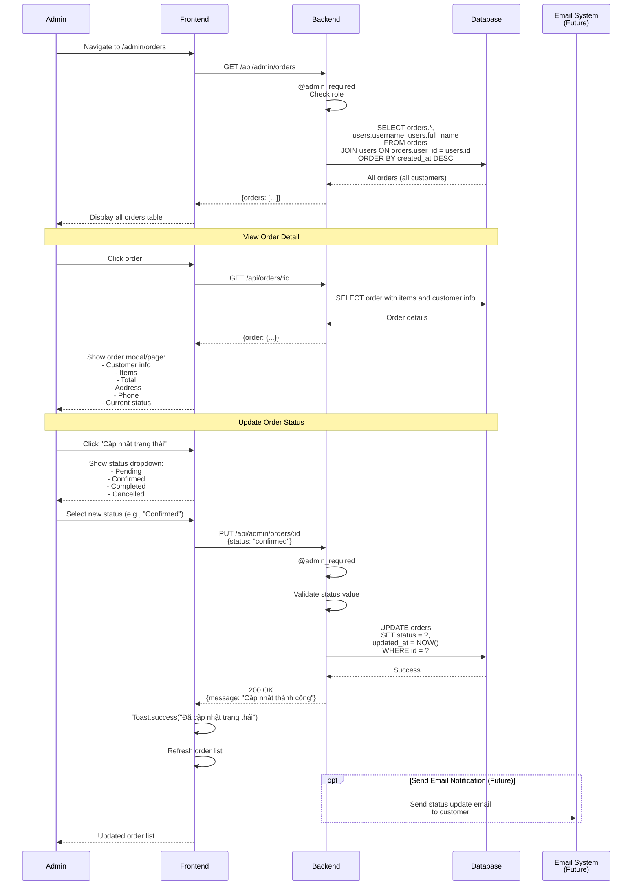
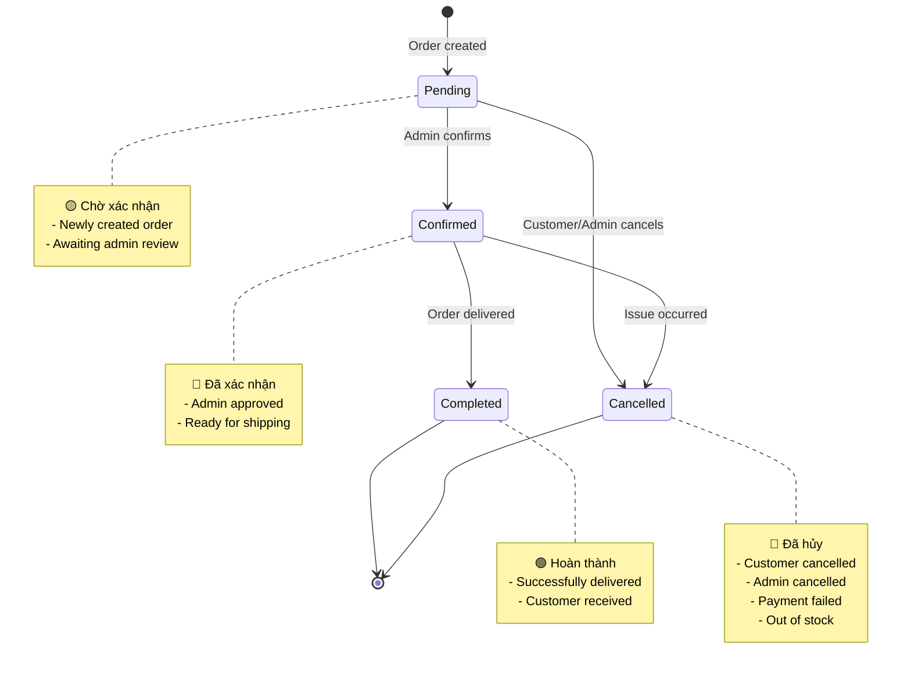

# 08 - Luồng Đặt Hàng (Order Flow)

## 🛒 Tổng Quan

Luồng đặt hàng là **core business process** của hệ thống, bao gồm:
1. Browse books → Add to cart
2. View & manage cart
3. Checkout with shipping info
4. Create order (transaction)
5. View order history
6. Admin updates order status

## 📊 Complete Order Flow Diagram



## 🔄 Detailed Step-by-Step Flows

### 1. Add to Cart Flow



### 2. Cart Management Flow



### 2.1. Item Selection in Cart

**Feature Overview:**

Giỏ hàng hỗ trợ chức năng select/deselect từng item, cho phép khách hàng:
- Chọn sản phẩm để thanh toán (giống Shopee/Lazada)
- Xóa nhiều sản phẩm cùng lúc
- Tổng tiền chỉ tính các sản phẩm được chọn

**Key Features:**
- Mỗi cart item có checkbox riêng
- Checkbox "Chọn tất cả" để select/deselect tất cả items
- Chỉ items được chọn mới được tính vào tổng tiền
- Chỉ items được chọn mới được checkout
- Button "Xóa (X)" xuất hiện khi có ≥1 item selected
- Checkout button hiển thị: "THANH TOÁN (X sản phẩm)"
- Checkout button disabled nếu không có item nào được chọn
- Default state: Tất cả items được chọn khi vào trang

**Implementation Details:**

```typescript
// CartPage.tsx - State management
const [selectedItems, setSelectedItems] = useState<number[]>([])

// Auto-select all items when cart loads
useEffect(() => {
  setSelectedItems(cart.map(item => item.id))
}, [cart.length])

// Select all/deselect all toggle
const handleSelectAll = () => {
  if (selectedItems.length === cart.length) {
    setSelectedItems([]) // Deselect all
  } else {
    setSelectedItems(cart.map(item => item.id)) // Select all
  }
}

// Toggle individual item selection
const handleSelectItem = (itemId: number) => {
  setSelectedItems(prev => {
    if (prev.includes(itemId)) {
      return prev.filter(id => id !== itemId)
    } else {
      return [...prev, itemId]
    }
  })
}

// Delete multiple selected items
const handleDeleteSelected = async () => {
  if (selectedItems.length === 0) return
  
  if (confirm(`Bạn có chắc muốn xóa ${selectedItems.length} sản phẩm đã chọn?`)) {
    try {
      await Promise.all(selectedItems.map(id => removeFromCart(id)))
      toast.success(`Đã xóa ${selectedItems.length} sản phẩm`)
      setSelectedItems([])
    } catch (error) {
      toast.error('Có lỗi khi xóa sản phẩm')
    }
  }
}

// Calculate total for selected items only
const getSelectedTotal = () => {
  return cart
    .filter(item => selectedItems.includes(item.id))
    .reduce((sum, item) => sum + (item.book.price * item.quantity), 0)
}
```

**User Flow:**



**UI/UX Notes:**

1. **Checkbox "Chọn tất cả":**
   - Màu xám khi không có item nào được chọn
   - Checked khi TẤT CẢ items được chọn
   - Button "Xóa (X)" hiện bên phải khi có items được chọn

2. **Individual Checkboxes:**
   - Mỗi cart item row có checkbox ở bên trái
   - Checkbox size: `w-5 h-5` cho dễ click
   - Cursor pointer cho UX tốt hơn

3. **Total Amount:**
   - Chỉ tính tổng tiền của items được chọn
   - Auto-update ngay khi user select/deselect

4. **Checkout Button:**
   - Disabled (gray) khi không có item nào được chọn
   - Hiển thị số lượng items: "THANH TOÁN (3 sản phẩm)"
   - Active (green) khi có ≥1 item selected

5. **Delete Selected Button:**
   - Chỉ hiện khi có ≥1 item được chọn
   - Màu đỏ (danger variant)
   - Hiển thị số lượng: "Xóa (5)"

### 3. Checkout & Order Creation Flow



### 4. View Order History Flow



### 5. Admin Order Management Flow



## 🔍 Order Status Lifecycle



## 💾 Database Operations

### Cart Operations

```sql
-- Add to cart (if not exists)
INSERT INTO cart (user_id, book_id, quantity, created_at)
VALUES (?, ?, ?, NOW());

-- Add to cart (if exists, update quantity)
UPDATE cart 
SET quantity = quantity + ?
WHERE user_id = ? AND book_id = ?;

-- Get cart with book details
SELECT cart.id, cart.quantity, cart.created_at,
       books.id as book_id, books.title, books.author, 
       books.price, books.image_url, books.stock
FROM cart
JOIN books ON cart.book_id = books.id
WHERE cart.user_id = ?;

-- Update cart item quantity
UPDATE cart 
SET quantity = ?
WHERE id = ? AND user_id = ?;

-- Remove from cart
DELETE FROM cart 
WHERE id = ? AND user_id = ?;

-- Clear cart (after order)
DELETE FROM cart 
WHERE user_id = ?;
```

### Order Operations

```sql
-- Create order
INSERT INTO orders (
    user_id, total_amount, status, payment_status,
    shipping_address, phone, created_at, updated_at
) VALUES (?, ?, 'pending', 'pending', ?, ?, NOW(), NOW())
RETURNING id;

-- Create order items
INSERT INTO order_items (order_id, book_id, quantity, price)
VALUES (?, ?, ?, ?);

-- Update book stock
UPDATE books 
SET stock = stock - ?
WHERE id = ?;

-- Get customer orders
SELECT o.*, 
       COUNT(oi.id) as item_count,
       SUM(oi.quantity) as total_items
FROM orders o
LEFT JOIN order_items oi ON o.id = oi.order_id
WHERE o.user_id = ?
GROUP BY o.id
ORDER BY o.created_at DESC;

-- Get order with items
SELECT o.*,
       u.username, u.full_name, u.email,
       oi.id as item_id, oi.quantity, oi.price,
       b.id as book_id, b.title, b.author, b.image_url
FROM orders o
JOIN users u ON o.user_id = u.id
LEFT JOIN order_items oi ON o.id = oi.order_id
LEFT JOIN books b ON oi.book_id = b.id
WHERE o.id = ?;

-- Update order status (Admin)
UPDATE orders 
SET status = ?, updated_at = NOW()
WHERE id = ?;
```

## 🔒 Business Rules & Validation

### Cart Validation
- ✅ User must be logged in
- ✅ Book must exist
- ✅ Quantity must be > 0
- ✅ Quantity cannot exceed stock

### Checkout Validation
- ✅ Cart must not be empty
- ✅ Shipping address required (not empty)
- ✅ Phone number required (10-11 digits)
- ✅ All books must have sufficient stock
- ✅ Total amount must be > 0

### Order Workflow Constraints
- ✅ **Atomic transaction**: All steps succeed or all rollback
- ✅ **Stock consistency**: Prevent overselling
- ✅ **Cart clearing**: Automatic after successful order
- ✅ **Price snapshot**: Use current price at order time

### Status Update Rules
- ✅ Only admin/staff can update status
- ✅ Valid status values: pending, confirmed, completed, cancelled
- ✅ Status transitions should be logical (pending → confirmed → completed)

## 🎯 Error Handling

### Common Errors

| Error | Cause | Solution |
|-------|-------|----------|
| **"Giỏ hàng trống"** | Cart empty at checkout | Add items first |
| **"Sách X không đủ hàng"** | Book stock < quantity | Reduce quantity or wait |
| **"Yêu cầu đăng nhập"** | User not authenticated | Login first |
| **"Địa chỉ không được để trống"** | Missing shipping address | Fill address |
| **"Số điện thoại không hợp lệ"** | Invalid phone format | Use 10-11 digits |

### Transaction Rollback Scenarios

```python
# OrderWorkflow.create_order_with_items()
try:
    db.session.begin()
    
    # Step 1-7...
    
    db.session.commit()
except Exception as e:
    db.session.rollback()  # ← Automatic rollback on any error
    raise e
```

**Rollback triggers:**
- Cart empty
- Insufficient stock
- Invalid data
- Database error
- Any exception during workflow

## 📊 Performance Considerations

### Optimization Strategies

1. **Batch Queries**: Fetch all order items in single query (JOIN)
2. **Indexes**: 
   - `cart(user_id, book_id)` - Composite index
   - `orders(user_id, created_at)` - List orders fast
   - `order_items(order_id)` - Join performance
3. **Transaction Scope**: Minimize transaction duration
4. **Pagination**: Limit orders per page (20 items)

### Query Performance

```sql
-- Efficient: Get orders with item count
EXPLAIN ANALYZE
SELECT o.id, o.total_amount, o.status, 
       COUNT(oi.id) as items
FROM orders o
LEFT JOIN order_items oi ON o.id = oi.order_id
WHERE o.user_id = 123
GROUP BY o.id
LIMIT 20;

-- Result: ~5-10ms with indexes
```

## 🧪 Testing Scenarios

### Happy Path
1. ✅ Add book to cart → Success
2. ✅ Update quantity → Cart updated
3. ✅ Checkout with valid data → Order created
4. ✅ View order history → Orders displayed
5. ✅ Admin updates status → Status changed

### Edge Cases
1. ⚠️ Add to cart with stock = 0 → Should fail
2. ⚠️ Checkout with insufficient stock → Transaction rollback
3. ⚠️ Concurrent orders for same book → Stock locking
4. ⚠️ Update cart after logout → 401 Unauthorized
5. ⚠️ Admin cancels confirmed order → Should update

---

## 📋 Summary

### Order Flow Summary

**Customer Side:**
1. Browse → Add to cart → Manage cart
2. Checkout → Fill info → Submit order
3. View orders → Track status

**Admin Side:**
1. View all orders
2. Review order details
3. Update status (pending → confirmed → completed)

### Key Components

- **CartContext**: Frontend cart state management
- **OrderWorkflow**: Backend transaction orchestration
- **Database Transaction**: Ensure atomicity
- **Status Lifecycle**: Clear state transitions

### Success Metrics

✅ **Transaction Safety**: All-or-nothing guarantee  
✅ **Stock Consistency**: No overselling  
✅ **User Experience**: Clear feedback at each step  
✅ **Admin Control**: Full order management  

---

**📌 Order flow là core business logic, được implement cẩn thận với transaction management và validation đầy đủ!**

